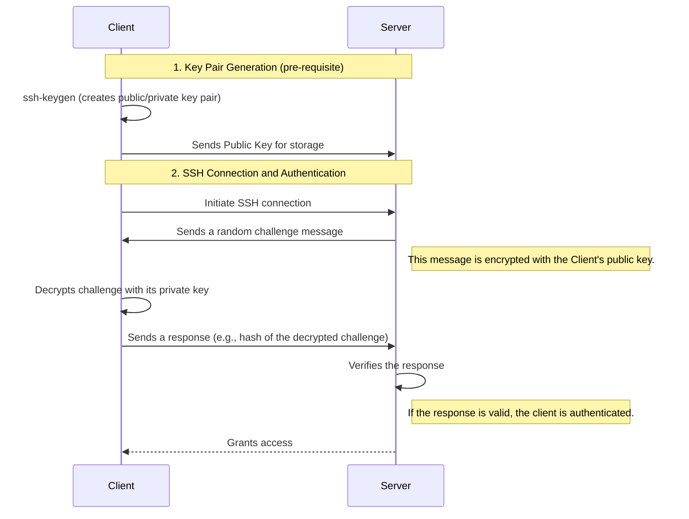

Use the `ls` command to see the contents of `bandit13`. 
```console
bandit13@bandit:~$ ls
sshkey.private
```
As shown, there is only one file, `sshkey.private`.

Now in order to solve this challenge, we need to learn about SSH keys and how to use them. 

In asymmetric cryptography, a key pair is used: a public key and a private key. The public key can be shared with anyone, while the private key must be kept secret. When you want to connect to a server using SSH, you can use your private key to authenticate yourself. The server will have your public key and will use it to verify that you are who you claim to be.

Here is a brief overview of how asymmetric cryptography works in the context of SSH:



Okay, now that we have a basic understanding of how SSH keys work, let's proceed with the challenge.

First, we need to change the permissions of the `sshkey.private` file to ensure that it is only readable by the owner. This is important for security reasons, as SSH will refuse to use a private key that is accessible by others. We can do this using the `ls -la` command to check the current permissions.

```console
bandit13@bandit:~$ ll
total 24
drwxr-xr-x   2 root     root     4096 Aug 15 13:15 ./
drwxr-xr-x 150 root     root     4096 Aug 15 13:18 ../
-rw-r--r--   1 root     root      220 Mar 31  2024 .bash_logout
-rw-r--r--   1 root     root     3851 Aug 15 13:09 .bashrc
-rw-r--r--   1 root     root      807 Mar 31  2024 .profile
-rw-r-----   1 bandit14 bandit13 1679 Aug 15 13:15 sshkey.private
```

As we can see, the permissions for `sshkey.private` are currently set to `-rw-r-----`, which means that the owner (bandit14) has read and write permissions, the group (bandit13) has read permissions, and others have no permissions.

So now we can just use the `ssh` command with the `-i` option which means identify file to connect to the next level using the private key. The command will look like this:

```console
bandit13@bandit:~$ ssh -i sshkey.private bandit14@bandit.labs.overthewire.org -p 2220
```

And we are in!

```console
bandit14@bandit:~$ whoami
bandit14
```

Now to get the password for bandit 14 we can read the corresponding file from `/etc/bandit_pass/` using the `cat` command.

```console
bandit14@bandit:~$ cat /etc/bandit_pass/bandit14
[REDACTED]
```